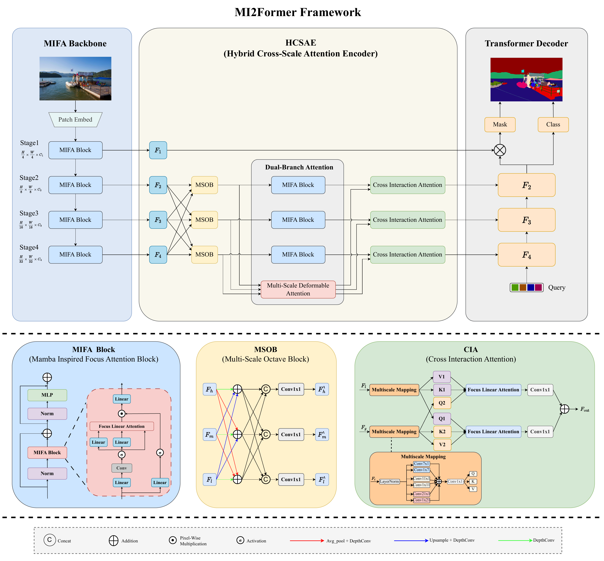
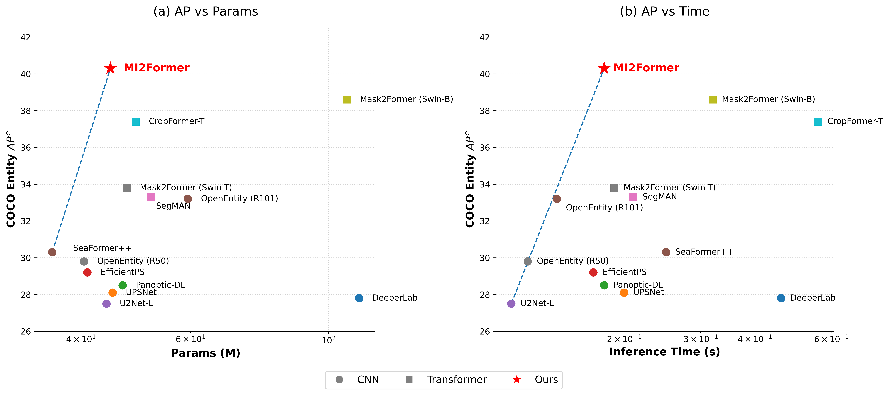

# MI2Former
Efficient Entity Segmentation with Mamba-Driven Lightweight Design

This project offers an implementation of the paper, "[MIFA2Former]". 

<div align="center">
  
</div><br/>

## News
2026-06-15 The dataset, code and pretrained models are released.


## Models
##  Weights of MI2Former.
(1) COCO Entity And EntitySeg Entity
| Alg | Train Data | Model and Config Url | Ap_e |
| ------| ------| ------|------|
| MIFA2Former | COCO Entity | [Google Drive](https://drive.google.com/drive/folders/1wdY1xDXH4JYyBesjAnTD2QsTONPUVEZz?usp=drive_link) |40.3 |
| MIFA2Former | EntitySeg Entity | [Google Drive](https://drive.google.com/drive/folders/1BCghu1TKMew7JaPKxPIJemiktT7WxwTU?usp=drive_link) | 42.7|


(2) ADE20K
| Alg | pre Train Data | Model and Config Url |
| ------| ------| ------|
| MIFA2Former | coco  | [Google Drive](will be soon) |
| MIFA2Former | coco | [Google Drive](will be soon) |


(3) CityScape
| Alg | pre Train Data | Model and Config Url |
| ------| ------| ------|
| MIFA2Former | coco  | [Google Drive](will be soon) |
| MIFA2Former | coco | [Google Drive](will be soon) |


## Comparison of Different Models on COCO Entity
with Parameters
<div align="center">
  
</div><br/>


| Method | Backbone | Train Step(COCO) | $AP^e$ $\uparrow$ | Train Step(EntitySeg) | $AP_L^e$ $\uparrow$ | Res. | Params (M) | Venue |
|:---:|:---:|:---:|:---:|:---:|:---:|:---:|:---:|:---:|
| DeeperLab$^{**}$ [1] | R101 | 5w | 27.8 | 5w | 32.1 | $1024^2$ | 112.0 | *CVPR19* |
| UPSNet$^{**}$ [2] | -- | 5w | 28.1 | 5w | 32.5 | $1024^2$ | 45.0 | *CVPR19* |
| Panoptic-DeepLab$^{**}$ [3] | -- | 5w | 28.5 | 5w | 33.0 | $1024^2$ | 46.7 | *CVPR20* |
| EfficientPS$^{**}$ [4] | -- | 5w | 29.2 | 5w | 33.8 | $1024^2$ | 41.0 | *IJCV21* |
| U2Net-L$^{**}$ [5] | -- | 5w | 27.5 | 5w | 31.9 | $1024^2$ | 44.0 | *PR2022* |
| SeaFormer(L)$^{**}$ [6] | -- | 5w | 29.7 | 5w | 34.4 | $1024^2$ | 36.0 | *ICLR23* |
| SeaFormer(L)++$^{**}$ [7] | -- | 5w | 30.3 | 5w | 35.1 | $1024^2$ | 36.0 | *IJCV25* |
| SegMAN(B)$^{**}$ [8] | -- | 5w | 33.3 | 5w | 37.1 | $1024^2$ | 51.8 | *CVPR25* |
| --- | --- | --- | --- | --- | --- | --- | --- | --- |
| FCOS-Seg [9] | R50 | 27w | 28.3 | -- | -- | $800\times1333$ | -- | *CVPR22* |
| OpenEntity [10] | R50 | 9w | 29.8 | -- | -- | $800\times1333$ | 40.5 | *TPAMI22* |
| OpenEntity-R50 [10] | R50 | 27w | 31.8 | -- | -- | $800\times1333$ | 40.5 | *TPAMI22* |
| OpenEntity-R101 [10] | R101 | 9w | 31.0 | -- | -- | $800\times1333$ | 59.4 | *TPAMI22* |
| OpenEntity [10] | R101 | 27w | 33.2 | -- | -- | $800\times1333$ | 59.4 | *TPAMI22* |
| OpenEntity [10] | R101-DCNv2 | 27w | 35.5 | -- | -- | $800\times1333$ | 60.2 | *TPAMI22* |
| OpenEntity-T [10] | Swin-T | 9w | 33.0 | -- | -- | $800\times1333$ | 42.1 | *TPAMI22* |
| OpenEntity-MiT [10] | MiT-b0 | 9w | 28.8 | -- | -- | $800\times1333$ | -- | *TPAMI22* |
| --- | --- | --- | --- | --- | --- | --- | --- | --- |
| Mask2Former [11] | R50 | 5w | 30.1 | 5w | 35.2 | $1024^2$ | 44.0 | *CVPR22* |
| Mask2Former [11] | Swin-T | 5w | 33.8 | 5w | 38.8 | $1024^2$ | 47.4 | *CVPR22* |
| Mask2Former [11] | Swin-B | 5w | $\underline{38.6}$ | 5w | $\underline{42.1}$ | $1024^2$ | 107 | *CVPR22* |
| CropFormer [12] | Swin-T | 5w | 37.4 | 5w | 40.6 | $1024^2$ | 49.0 | *ICCV23* |
| --- | --- | --- | --- | --- | --- | --- | --- | --- |
| **MI2Former** | **Mifa-T** | 5w | **40.3** | 5w | **42.70** | $1024^2$ | 44.64 | **Ours** |

## Data
#### Coco entity dataset
(1) Generate the entity information of each image by the instance and panoptic annotation. Please change the path of coco annotation files in the following code.
```bash
cd /path/to/detectron2/projects/MIFA2Former/make_data
bash make_entity_mask.sh
```
(2) Change the generated entity information to the json files.
```bash
cd /path/to/detectron2/projects/MIFA2Former/make_data
python3 entity_to_json.py
```
### Entityseg entity dataset
(1)  refer to the official repo [EntitySeg-Dataset](https://github.com/adobe-research/EntitySeg-Dataset) for annotation files and image URLs.
For convenience, we provide the images in several links including [Google Drive](https://drive.google.com/drive/folders/1yX2rhOroyhUCGCrmzSm7DL4BfQWvcG0v?usp=drive_link) and [Hugging Face](https://huggingface.co/datasets/qqlu1992/Adobe_EntitySeg), but we do not own the copyright of the images. It is solely your responsibility to check the original licenses of the images before using them. Any use of the images are at your own discretion and risk. Furthermore, please refer to [the dataset description](DATA.md) on how to set up the dataset before running our code.

## Code
We offer the instructions on installation, evaluation and visualization for the proposed MIFA2Former.

## Installation
This project is based on [Detectron2](https://github.com/facebookresearch/detectron2), which can be constructed as follows.
* Install Detectron2 following [the instructions](https://detectron2.readthedocs.io/tutorials/install.html). We are noting that our code is implemented in detectron2 commit version 28174e932c534f841195f02184dc67b941c65a67 and pytorch 1.8.
* Setup the coco dataset including instance and panoptic annotations following [the structure](https://github.com/facebookresearch/detectron2/blob/master/datasets/README.md). The code of entity evaluation metric is saved in the file of modified_cocoapi. You can directly replace your compiled coco.py with modified_cocoapi/PythonAPI/pycocotools/coco.py. 
* Copy this project to `/path/to/detectron2/projects/EntitySeg`
* Set the "find_unused_parameters=True" in distributed training of your own detectron2. You could modify it in detectron2/engine/defaults.py.

## Training
To train model with 8 GPUs, run:
```bash
cd /path/to/detectron2
python3 projects/train_net.py --config-file <projects/MIFA2Former/configs/config.yaml> --num-gpus 8
```

## Evaluation
To evaluate a pre-trained model with 8 GPUs, run:
```bash
cd /path/to/detectron2
python3 projects/MIFA2Former/train_net.py --config-file <config.yaml> --num-gpus 8 --eval-only MODEL.WEIGHTS model_checkpoint
```

## Visualization
To visualize some image result of a pre-trained model, run:
```bash
cd /path/to/detectron2
python3 projects/MIFA2Former/demo_result_and_vis.py --config-file <config.yaml> --input <input_path> --output <output_path> MODEL.WEIGHTS model_checkpoint MODEL.CONDINST.MASK_BRANCH.USE_MASK_RESCORE "True"
```
For example,
```bash
python3 projects/MIFA2Former/demo_result_and_vis.py --config-file projects/MIFA2Former/configs/entity_swin_lw7_1x.yaml --input /data/input/*.jpg --output /data/output MODEL.WEIGHTS /data/pretrained_model/R_50.pth MODEL.CONDINST.MASK_BRANCH.USE_MASK_RESCORE "True"
```

## Params and Flops
<div align="center">
  
</div><br/>


## <a name="License"></a>License
The code and models are released under the [CC BY-NC 4.0 license](https://creativecommons.org/licenses/by-nc/4.0/).
